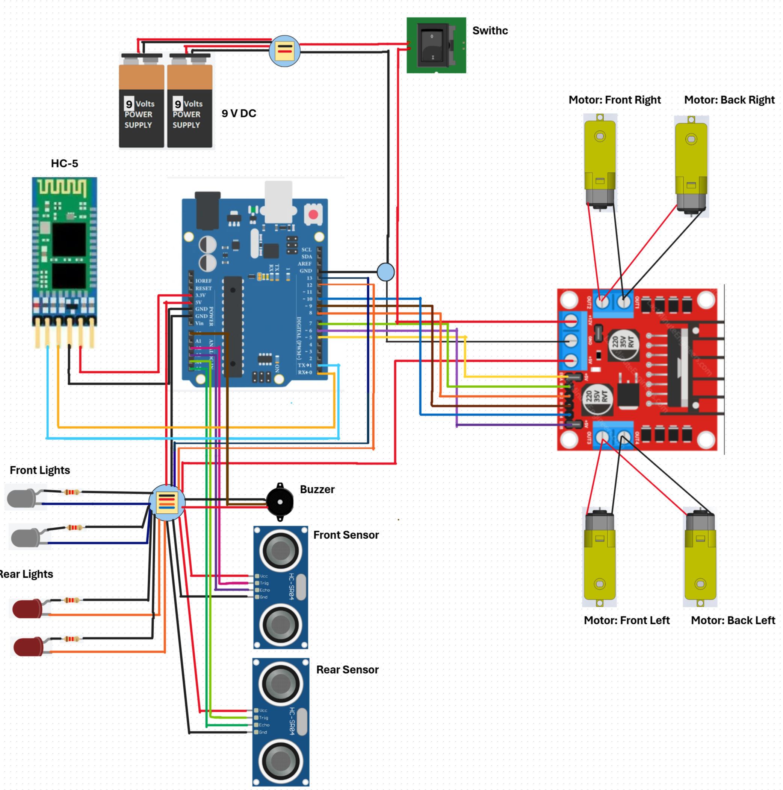
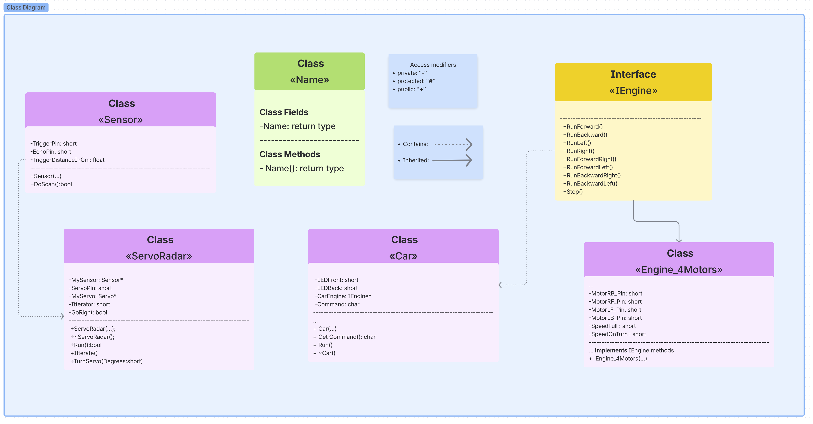
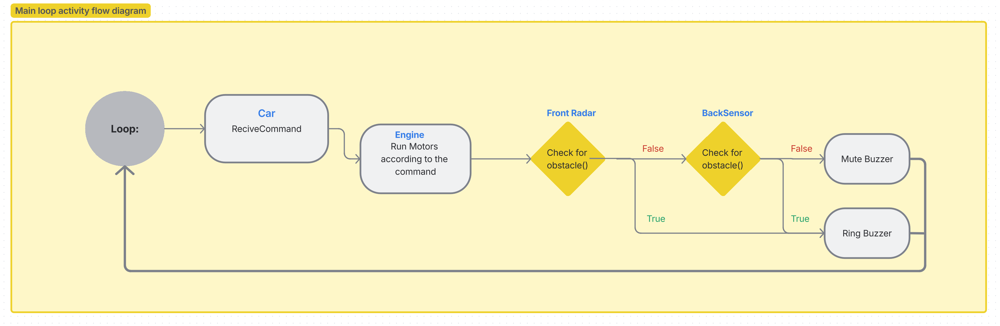
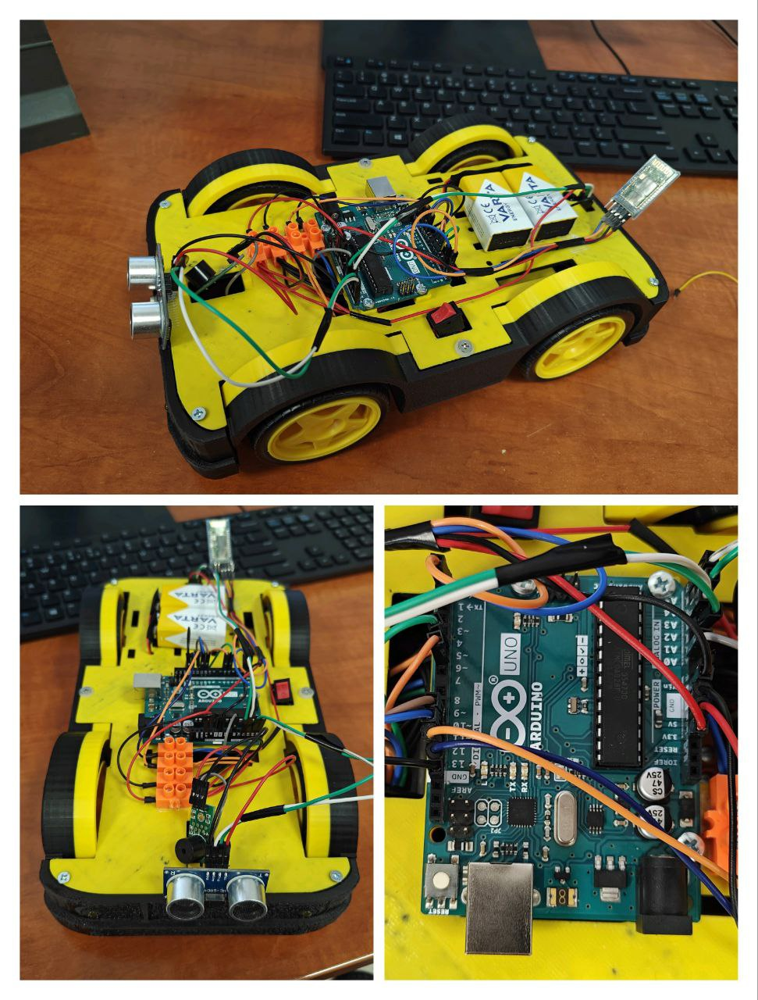

# Arduino-RC-Car
This project was made as a part of Embedded system subject in  my University WSB-NLU 

 Is required to have Mobile app: [BT Car Controller](https://play.google.com/store/apps/details?id=com.giristuido.bluetooth.car.controller&hl=pl)

## Circuit Diagram:

## Here is Class Diagram:

## Main loop action flow: 

## Photos of the car itself:

## Photos of mobile app sending the signal to the car:
![Mobile App][Photos/MobileApp.jpg]

